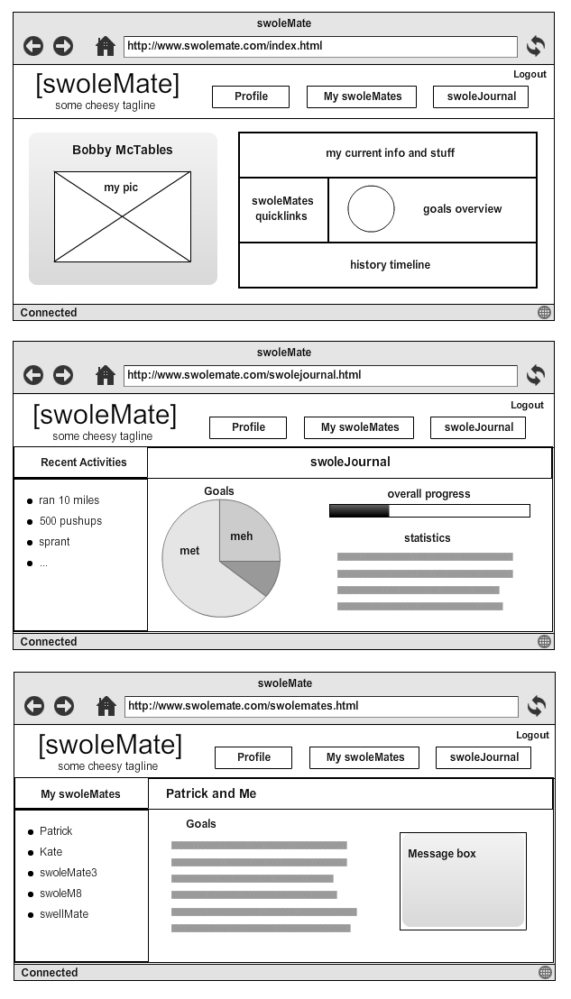

 SwoleMate
============

Problem statement: How do you stay motivated while working out? How are you 
held accountable to sticking to a workout plan? Maybe your firends aren't at 
the same level of fitness or dont have the same goals as you. 

**How do we solve the problem?**
* web application that allows users to find workout buddies by matching a 
		series of criterion, and facilitating conversations between users
* swoleMate will help you find someone with similar goals and capabilities 
		(if thats what youre into) who you can be gym 
		buddies/motivators/coaches/SWOLEMATES

**List of features we'll implement:**
* pretty interface
* give user list of potential gym buddies based on our profile criterion 
	  match algorithm (see data we'll be using and collecting for the specific
	  criterion)
* messaging service; ability to contact other users who both match
* ability to confirm when a goal has been met

Pick 5
------
	* Geolocation
	* server side data persistence. 
	* front end framework 
	* send emails and sms
	* reporting with charts and graphs

**Data we'll be using and collecting**
* keep track of users' profiles, descriptions, data, friends
* history of commitments / goals met
* whether the user is looking for cardio, weightlifting, or both
* user's name and age

**Algorithms**
* match people with similar criterion
	Each criterion has a weighted value, and calculates weighted euclydian 
	distance between users. Whenever the calculated distance is less than
	a certain constant, the users are displayed on each others' match-screens.
	There will be a certain n number of people that can be matched at any 
	given time for a user. The best match will be placed first. 

**Electronic mockups**
* see image file:

#Comments by Ming
* Pretty good idea
* Is this a dating service?  You might as well turn this into one.
